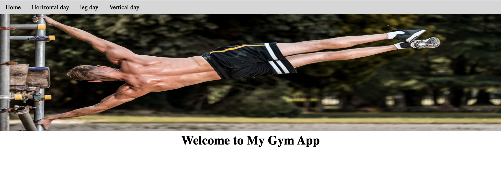
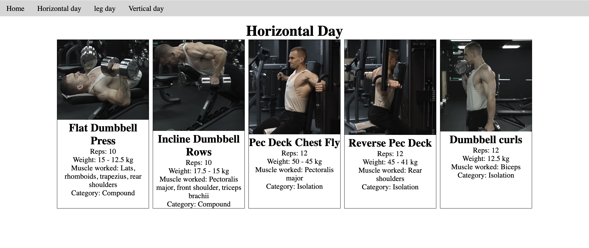
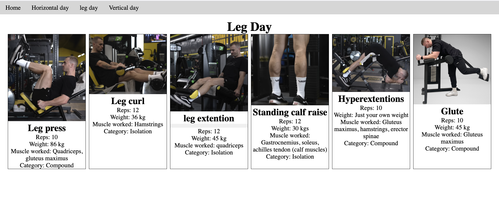

# Gym web application

The objective of this project is to develop a web application that allows to personlaize a gym routine.

## Running the application locally

You can clone this repository, open it in VS Code, and use Live Server to deploy it. The app will be available in `http://localhost:5500`.

## Home page

## Horizontal day

## Leg day

## Vertical day

## Authors

[Yavuz Aspheles](https://github.com/Aspheles)

[Camilo Nuñez](https://github.com/camillonunez1998)

## License

[MIT](./LICENSE)